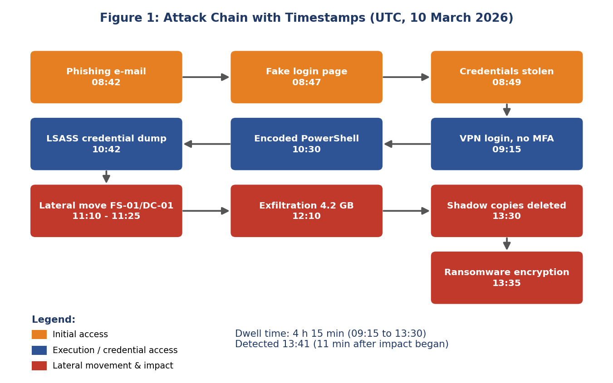
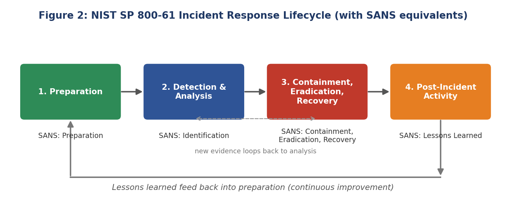
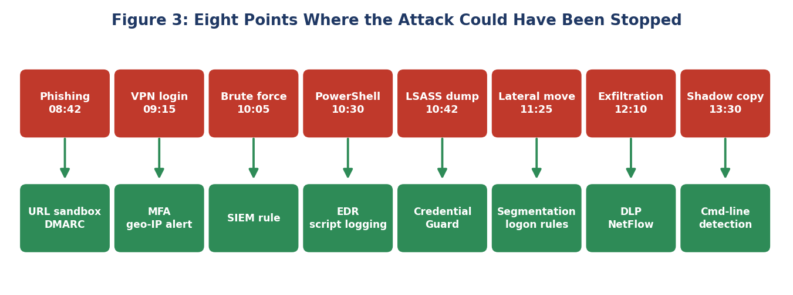
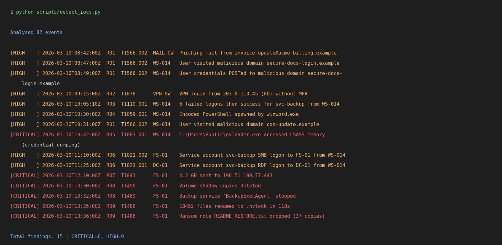

# 🛡️ Virtual Security Incident Response Simulation

> **Scenario:** Phishing → Credential Theft → Lateral Movement → Data Exfiltration → Ransomware
> **Frameworks:** NIST SP 800-61 Rev. 2 (primary), SANS PICERL (cross-reference), MITRE ATT&CK (mapping)
> **Type:** Fully *simulated* exercise. All companies, users, IPs, domains and hashes are **fictional**.

This repository documents an end-to-end incident response (IR) exercise for a fictional company,
**NovaTech Solutions**. It contains the scenario, indicators of compromise (IOCs), a framework-based
response plan, a simulated response timeline, a post-incident analysis, and working Python tooling
that detects the attack in synthetic logs.

---

## 📁 Repository Structure

```
ir-simulation/
├── README.md
├── docs/
│   ├── 01-scenario.md                  # Company, network, attack narrative
│   ├── 02-ioc-and-attack-analysis.md   # IOCs, source & method of attack, scope
│   ├── 03-incident-response-plan.md    # NIST 800-61 + SANS step-by-step plan
│   ├── 04-simulated-response-timeline.md  # What we did, minute by minute
│   ├── 05-post-incident-analysis.md    # Gaps, root cause, impact, metrics
│   ├── 06-lessons-learned-and-recommendations.md
│   ├── 07-mitre-attack-mapping.md
│   ├── 08-frameworks-comparison.md     # NIST vs SANS
│   └── 09-references.md
├── playbooks/ransomware-playbook.md    # Quick-reference runbook
├── logs/                               # Generated synthetic logs (events.jsonl)
├── iocs/iocs.csv                       # Machine-readable IOC list
├── detections/
│   ├── sigma/*.yml                     # Sigma-style detection rules
│   └── yara/ransomware_note.yar        # YARA rule for ransom note / extension
├── scripts/
│   ├── generate_logs.py                # Builds synthetic attack logs (deterministic)
│   ├── detect_iocs.py                  # Detection engine: finds attack in logs
│   └── build_timeline.py               # Creates Markdown timeline from detections
├── templates/incident-report-template.md
├── diagrams/attack-chain.md            # Mermaid diagrams
└── diagrams/images/*.png               # Figures used in the report
```

## 🚀 Quick Start

Requires **Python 3.8+** only (no external libraries).

```bash
# 1. Generate the synthetic logs
python scripts/generate_logs.py

# 2. Run the detection engine
python scripts/detect_iocs.py

# 3. Build the incident timeline
python scripts/build_timeline.py
```

Expected output of step 2 (abridged):

```
Analysed 82 events

[HIGH    ] 2026-03-10T08:42:00Z  R01  T1566.002  MAIL-GW  Phishing mail from invoice-update@acme-billing.example
[HIGH    ] 2026-03-10T09:15:00Z  R02  T1078      VPN-GW   VPN login from 203.0.113.45 (RO) without MFA
[CRITICAL] 2026-03-10T10:42:00Z  R05  T1003.001  WS-014   nvloader.exe accessed LSASS memory (credential dumping)
[CRITICAL] 2026-03-10T13:35:00Z  R09  T1486      FS-01    18452 files renamed to .nvlock in 118s
...
Total findings: 15 | CRITICAL=6, HIGH=9
```

## 🖼️ Visuals







Detection engine output on the synthetic logs:



## 🧭 How This Maps to the Task Requirements

| Task requirement | Where it is covered |
|---|---|
| Examine simulation scenario | `docs/01-scenario.md` |
| Identify IOCs, analyse source & method | `docs/02-ioc-and-attack-analysis.md`, `iocs/iocs.csv`, `scripts/detect_iocs.py` |
| Step-by-step plan using NIST / SANS | `docs/03-incident-response-plan.md`, `playbooks/` |
| Simulated response: detect, isolate, restore | `docs/04-simulated-response-timeline.md` |
| Post-incident analysis (gaps, improvements) | `docs/05-post-incident-analysis.md` |
| Lessons learned & framework changes | `docs/06-lessons-learned-and-recommendations.md` |

## 👤 Author

**Shivam Sharma** · GitHub: [@Shivm569](https://github.com/Shivm569)  
Project: https://github.com/Shivm569/ir-simulation  
Report date: 2 October 2026 (simulated incident date: 10 March 2026)

## ⚠️ Disclaimer

Educational simulation only. IPs use reserved documentation ranges (RFC 5737: `203.0.113.0/24`,
`198.51.100.0/24`), domains use `.example`, and hashes are made up. No real malware is included.
