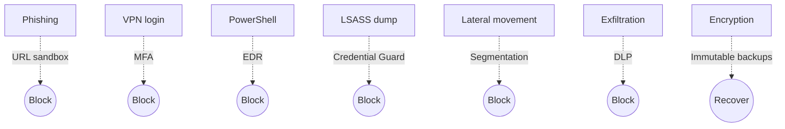

# Attack Chain Diagrams

## Attack Flow

```mermaid
flowchart LR
  A[Phishing e-mail 08:42] --> B[Fake login page 08:47]
  B --> C[Credentials stolen 08:49]
  C --> D[VPN login, no MFA 09:15]
  D --> E[Encoded PowerShell 10:30]
  E --> F[LSASS dump 10:42]
  F --> G[Lateral move to FS-01 / DC-01 11:10-11:25]
  G --> H[Exfiltration 4.2 GB 12:10]
  H --> I[Shadow copies deleted 13:30]
  I --> J[Encryption 13:35]
  J --> K[Ransom note 13:36]
```

## Where Controls Would Have Stopped It

```mermaid
flowchart TB
  A[Phishing] -. URL sandbox .-> X1((Block))
  B[VPN login] -. MFA .-> X2((Block))
  C[PowerShell] -. EDR .-> X3((Block))
  D[LSASS dump] -. Credential Guard .-> X4((Block))
  E[Lateral movement] -. Segmentation .-> X5((Block))
  F[Exfiltration] -. DLP .-> X6((Block))
  G[Encryption] -. Immutable backups .-> X7((Recover))
```
