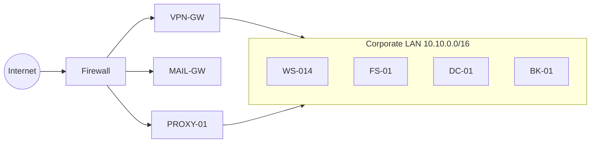

# 01 – Scenario Description

## 1. Organisation Profile (fictional)

| Item | Detail |
|---|---|
| Company | **NovaTech Solutions Pvt. Ltd.** (mid-size IT services firm) |
| Employees | ~350 |
| Industry | Software development & managed IT services |
| Crown jewels | Client source code, client contracts, HR & payroll data |
| Work model | Hybrid (office + VPN) |

## 2. Network Overview

| Asset | Role | OS | Criticality |
|---|---|---|---|
| `DC-01` | Active Directory Domain Controller | Windows Server 2019 | Critical |
| `FS-01` | Main file server (project shares, HR) | Windows Server 2019 | High |
| `BK-01` | Backup server | Windows Server 2019 | High |
| `WS-014` | Employee workstation (Finance, user *priya.sharma*) | Windows 11 | Medium |
| `VPN-GW` | Remote access gateway | Appliance | High |
| `MAIL-GW` | Email security gateway | Appliance | Medium |
| `PROXY-01` | Web proxy | Linux | Medium |

## 3. Security Posture *Before* the Incident (the gaps)

| Control | State | Weakness |
|---|---|---|
| Email filtering | Basic spam filter | No URL rewriting/sandboxing |
| MFA | Only for admins | Regular users & **service accounts have no MFA** |
| Passwords | 8-char minimum | Service account `svc-backup` used a weak, never-rotated password |
| Endpoint | Legacy antivirus | No EDR, no PowerShell logging alerts |
| Segmentation | Flat network | Workstations can reach file/DC servers over SMB/RDP |
| Backups | Nightly to `BK-01` | Backup server domain-joined, **same credentials**, not immutable |
| Logging | Local logs only | No central SIEM; nobody reviews logs daily |
| Training | Annual slideshow | No phishing simulations |

## 4. Attack Narrative (what the "threat actor" does)

Date of incident: **10 March 2026 (UTC)**. Threat actor is a financially motivated
ransomware crew, internally nicknamed **"NOVA-LOCK"** for this exercise.

1. **Initial access (08:42):** Phishing email *"Invoice #88231 overdue"* hits a Finance employee.
   The link leads to a fake Microsoft 365 login page.
2. **Credential theft (08:49):** The employee enters her credentials. The attacker now owns her account.
3. **Remote access (09:15):** Attacker logs into the VPN from an unusual country (`203.0.113.45`) – no MFA required.
4. **Execution (10:30):** Encoded PowerShell is run on `WS-014`, which downloads a loader.
5. **Credential access (10:42):** LSASS memory is dumped; the `svc-backup` password hash/credential is obtained.
6. **Lateral movement (11:10 – 11:25):** Attacker uses `svc-backup` to reach `FS-01` (SMB) and `DC-01` (RDP).
7. **Exfiltration (12:10):** ~4.2 GB of data is sent to `198.51.100.77` (double-extortion).
8. **Impact (13:30 – 13:36):** Shadow copies deleted, backup agent stopped, 18,452 files encrypted
   with the `.nvlock` extension, ransom note `README_RESTORE.txt` dropped.
9. **Discovery (13:41):** Helpdesk receives calls (files won't open) and the legacy AV finally raises an alert.

Dwell time (first access → impact): **~4 hours 15 minutes**.

## 5. Scope & Assumptions of the Exercise

* Everything is simulated; logs are synthetic and deterministic (seeded generator).
* The team is the *Computer Security Incident Response Team (CSIRT)* of NovaTech.
* Decisions are taken as the CSIRT would, using NIST SP 800-61 Rev. 2.
