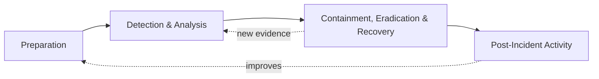

# 08 – Framework Comparison: NIST vs SANS

| Aspect | NIST SP 800-61 Rev. 2 | SANS PICERL |
|---|---|---|
| Phases | 4 | 6 |
| Steps | Preparation → Detection & Analysis → Containment/Eradication/Recovery → Post-Incident | Preparation → Identification → Containment → Eradication → Recovery → Lessons Learned |
| Style | Cyclical (lessons feed preparation) | Linear checklist |
| Best for | Policy, governance, compliance | Hands-on technical response |
| Why chosen here | Structure of the plan & documentation | Granular steps inside Phase 3 |

**Approach used in this project:** NIST gives the outer structure; SANS gives the technical granularity
for containment, eradication, and recovery. Note NIST **merges** these three into one phase because
in practice they overlap and iterate.

## Other Frameworks Referenced
* **MITRE ATT&CK** – adversary behaviour (doc 07)
* **NIST CSF 2.0** – target security improvements (doc 06)
* **Lockheed Martin Cyber Kill Chain** – attack stages (doc 02)
* **CIS Controls v8** – prioritised hardening (MFA, backups, logging)
