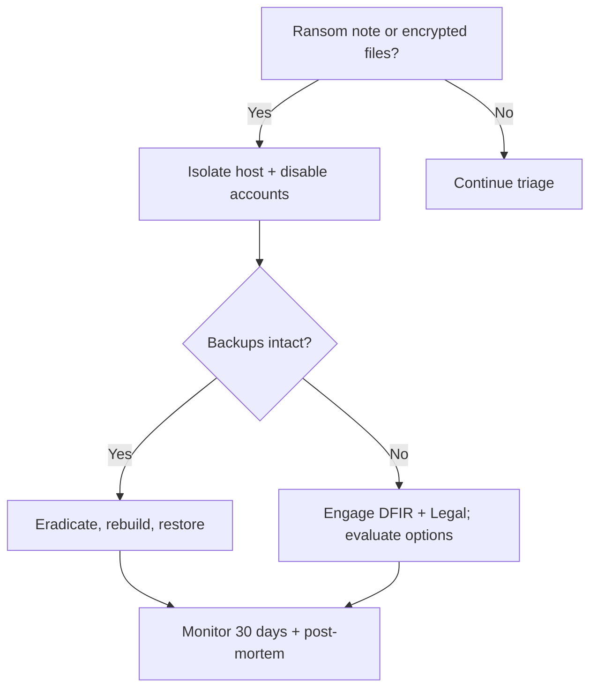

# Ransomware Quick-Reference Playbook

> Print this. Use it when the stress is high. Full details: `docs/03-incident-response-plan.md`.

## 🔴 First 15 Minutes
- [ ] Do **not** power off. Do **not** pay or reply to attacker.
- [ ] Record the time, who reported, what was seen. Open ticket.
- [ ] Isolate affected host(s) from network (EDR quarantine / unplug cable / disable switch port).
- [ ] Disable the suspected accounts; kill VPN/remote sessions.
- [ ] Protect backups: disconnect backup server, verify offline copies.
- [ ] Declare incident severity; page the Incident Commander.

## 🟠 First Hour
- [ ] Capture RAM, then disk image (hash every image with SHA-256).
- [ ] Identify patient zero and the entry vector (e-mail? VPN? RDP? vuln?).
- [ ] Block IOCs (IPs, domains, hashes) at firewall, DNS, proxy, EDR.
- [ ] Check for data theft (large egress, rclone/MEGA/WinSCP usage).
- [ ] Identify variant: upload the note + sample encrypted file to ID Ransomware / No More Ransom (public tools).
- [ ] Legal/Compliance + Comms informed.

## 🟡 Containment → Eradication → Recovery
| Step | Command / Action | Verification |
|---|---|---|
| Disable account | `Disable-ADAccount -Identity <user>` | `Get-ADUser <user> -Properties Enabled` |
| Kill sessions | `query user /server:<host>` then `logoff <id>` | no active sessions |
| Reset krbtgt (twice, 10h apart) | `Reset-KrbtgtPassword` script (Microsoft) | Kerberos tickets invalid |
| Check persistence | `schtasks /query /fo LIST /v`, `Get-Service`, autoruns | no unknown entries |
| Restore | restore from clean backup into isolated VLAN | AV/EDR scan + hash/sample check |
| Reimage | Rebuild from gold image, patch before reconnecting | CIS baseline check |

## 🟢 After the Incident
- [ ] Post-mortem within 7 days (blameless).
- [ ] Update detections and playbooks.
- [ ] Track recommendations to closure.

## Decision Tree

